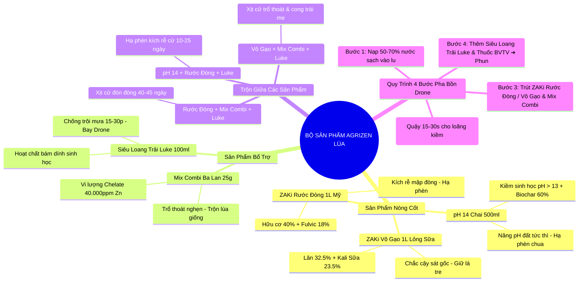

# 🧪 1.7. HƯỚNG DẪN PHỐI TRỘN & TƯƠNG THÍCH NÔNG HỌC (AGRIZEN LÚA)

Tài liệu này dùng để **Hướng dẫn kỹ thuật phối trộn chuẩn cho Kỹ sư thị trường, Telesales và Bà con nông dân** cho bộ 5 sản phẩm cốt lõi: **pH 14 (Chai 500ml), ZAKi Rước Đòng Organic (Lon 1L Mỹ), ZAKi Vô Gạo Organic (Lon 1L lỏng sữa), Phân Bón Vi Lượng Mix Combi (Ba Lan) & Siêu Loang Trải Luke 100%**.

---

## 🧠 SƠ ĐỒ MINDMAP NGUYÊN TẮC PHỐI TRỘN (MERMAID DIAGRAM)

---

## 📊 1. TÍNH PHỐI TRỘN GIỮA CÁC SẢN PHẨM PHỔ BIẾN

| STT | Sản Phẩm 1 | Sản Phẩm 2 | Mức Độ Tương Thích | Tác Dụng Khi Trộn Chung (Thực Tế) | Giai Đoạn Phun Cho Lúa |
| :---: | :--- | :--- | :---: | :--- | :--- |
| **1** | **pH 14 Hạ Phèn Nâng pH** *(Chai 500ml)* | **ZAKi Rước Đòng Organic** *(Lon 1L Mỹ)* | **Pha chung 100%** *(Cho pH 14 vào nước trước)* | • Nâng pH đất tức thì từ 4.0 lên 6.0. • Phèn nhôm $Al^{3+}$, phèn sắt $Fe^{2+}$ bị kết tủa ngắt độc. • Axit Fulvic kích rễ tơ bung trắng phau bám sâu. | Đẻ nhánh & Đón đòng (10 - 45 ngày) |
| **2** | **ZAKi Rước Đòng Organic** *(Lon 1L nhập Mỹ)* | **Mix Combi Ba Lan** *(Gói vi lượng 25g)* | **Pha chung 100%** *(Rất hợp nhau)* | • Kích rễ tơ bung trắng phau bám sâu. • Đòng nhú tim đèn mập ú, lá đòng dầy xanh như lá tre. • Lúa trổ thoát rộ, không lo bị nghẹn đòng. | Cử Tim đèn / Đón đòng (40 - 45 ngày) |
| **3** | **ZAKi Rước Đòng Organic** *(Lon 1L nhập Mỹ)* | **Siêu Loang Trải Luke** *(Chai 100ml)* | **Pha chung 100%** *(Rất hợp nhau)* | • Giăng màng loang trải cực mỏng bao phủ lá lúa. • Hấp thụ nhanh dinh dưỡng hữu cơ Mỹ sau 15-30 phút. • Chống rửa trôi khi gặp mưa rào mùa Hè Thu. | Mọi cử xịt có Rước Đòng (25 - 45 ngày) |
| **4** | **ZAKi Vô Gạo Organic** *(Lon 1L lỏng sữa)* | **Mix Combi Ba Lan** *(Gói vi lượng 25g)* | **Pha chung 100%** *(Rất hợp nhau)* | • Bổ sung vi lượng Kẽm Bo Chelate đậm đặc. • Giữ lá đòng xanh mướt tới ngày gặt. • Hoa lúa thụ phấn rộ đợt trổ lẹt xẹt, chống lép cậy. | Cử Trổ lẹt xẹt & Cong trái me (55 - 70 ngày) |
| **5** | **ZAKi Vô Gạo Organic** *(Lon 1L lỏng sữa)* | **Siêu Loang Trải Luke** *(Chai 100ml)* | **Pha chung 100%** *(Rất hợp nhau)* | • Dồn tinh bột Kali sữa nhanh vào hạt lúa. • Chắc cậy sát gốc 100%, vỏ trấu vàng sáng óng. • Dung dịch tan 100%, không nghẹt béc xịt máy bay. | Mọi cử xịt có Vô Gạo (55 - 75 ngày) |
| **6** | **ZAKi Rước Đòng Organic** *(50ml/bình 25L)* | **ZAKi Vô Gạo Organic** *(50ml/bình 25L)* | **Pha chung 100%** *(Rất hợp nhau)* | • Bổ sung đủ NPK lỏng và Hữu cơ Mỹ cùng lúc. • Vừa dầy lá tre vừa ngậm sữa chắc cậy nhanh. • Dung dịch mát cây, tan 100% không đục cặn. | Cử Trổ đều / Cong trái me (60 - 68 ngày) |

---

## 🚫 2. DANH MỤC CÁC CHẤT KÉN / KHÔNG NÊN PHỐI TRỘN KHI RA ĐỒNG RUỘNG

| STT | Chất / Nhóm Thuốc Kén Kỵ | Tên Sản Phẩm Bị Kén | Lý Do Hóa Sinh & Hiện Tượng | Tác hại Nếu Lỡ Pha Trộn | Cách Xử Lý & Khuyên Dùng |
| :---: | :--- | :--- | :--- | :--- | :--- |
| **1** | **Chế phẩm Canxi vô cơ thô nồng độ cao** | pH 14 & ZAKi Vô Gạo | Nồng độ kiềm cao của pH 14 hoặc Lân lỏng Vô Gạo gặp Canxi thô dễ tạo kết tủa Hydroxit Canxi / Phốt phát Canxi. | • Xuất hiện vệt vôi đục trong bồn. • Làm giảm hiệu lực phân bón. • Đóng cặn nghẹt béc xịt Drone. | **HÒA pH 14 VÀO NƯỚC TRƯỚC.** Pha loãng kiềm trong thể tích nước lớn trước khi trút sản phẩm khác. |
| **2** | **Phân bón chứa CANXI THÔ ($Ca^{2+}$)** *(Phân Canxi Nitrat thô, Vôi sữa)* | ZAKi Vô Gạo Organic *(Lân lỏng 32.5%)* | Ion Lân lỏng P2O5 gặp Ion Canxi thô Ca2+ phản ứng tạo Phốt-phát Canxi không tan. | • Xuất hiện vệt vôi trắng ngà trong lu nước. • Mất tác dụng vô gạo của Lân lỏng. • Gây đóng cặn béc phun. | **KHÔNG PHA CHUNG LÂN LỎNG VỚI CANXI THÔ.** Dùng vi lượng Chelate thay thế. |
| **3** | **Thuốc bệnh ĐỒNG VÔ CƠ THÔ** *(CuSO4 thô, Cốc 85 đậm đặc)* | ZAKi Vô Gạo & Mix Combi Ba Lan | Đồng vô cơ thô nồng độ cao có tính oxy hóa mạnh, phản ứng muối gây sốc nóng. | • Dễ làm sém chóp lá đòng khi nắng gắt. • Làm biến tính vi lượng Chelate. | Nên pha riêng biệt. Hòa loãng thuốc bệnh trước khi xịt. |

---

## 💧 3. QUY TRÌNH 4 BƯỚC PHA BỒN DRONE & BÌNH ĐIỆN CHUẨN NÔNG HỌC

> [!IMPORTANT]
> **QUY TẮC VÀNG PHA BỒN TRÚT pH 14:**
> 1. **BƯỚC 1: ĐỔ 50% - 70% NƯỚC SẠCH VÀO BỒN/LU CHỨA**
> 2. **BƯỚC 2: CHẾ pH 14 VÀO TRƯỚC VÀ QUẬY ĐỀU 15-30 GIÂY** (Hòa loãng kiềm sinh học pH > 13 vào nước trước).
> 3. **BƯỚC 3: TRÚT ZAKi RƯỚC ĐÒNG / VÔ GẠO & MIX COMBI BA LAN VÀO QUẬY TAN 100%**
> 4. **BƯỚC 4: THÊM SIÊU LOANG TRẢI LUKE & THUỐC TRỪ SÂU/BỆNH, BỔ SUNG ĐỦ NƯỚC VÀ PHUN**

---
🔗 **Liên kết quay lại:** [[0. Agrizen Lúa MOC 🌾]] | [[1.9. Nghiên Cứu Chuyên Sâu pH 14]] | [[Salekit_Ban_Hang_Agrizen_Lua.xlsx]]

